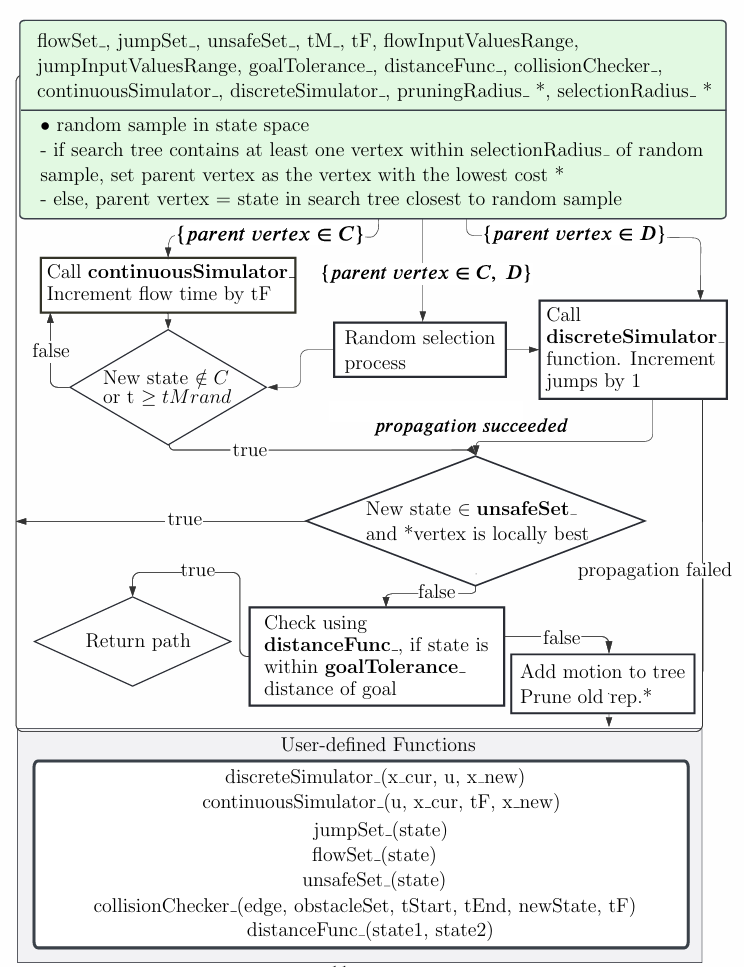
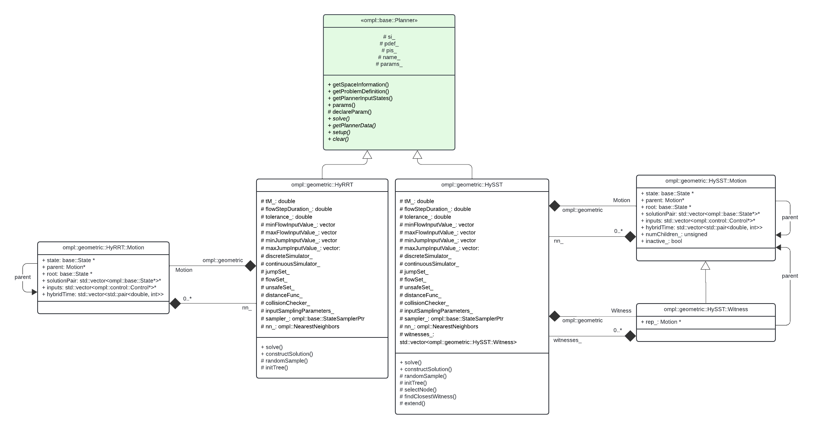

# cHyRRT
A C++ hybrid rapidly-exploring random tree motion planner, compatible with OMPL and ROS 2 Humble.

<p align="center">
    
    
</p>

# Hybrid Rapidly-Exploring Random Trees (HyRRT)

**Motion Planning** is a computational problem that involves finding a sequence of valid configurations to move the robot from the source to the destination. 

This repository provides the implementation of **HyRRT** in C++, compatible with OMPL and ROS 2 Humble. Vertices are implemented as the class `ompl::geometric::planners::RRT::HyRRT::Motion` (see `HyRRT.h`) and edges as a pointer to the parent vertex of the same type, contained within each Motion. As these pointers cannot contain additional information to store the solution pair, the solution pair is instead stored within the child vertex, as an attribute of the `Motion` class. The theory analysis of HyRRT can be found at [N. Wang and R. G. Sanfelice](https://ieeexplore.ieee.org/document/9992444). Furthermore, we already provide a [MATLAB](https://github.com/HybridSystemsLab/hybridRRT) version, without compatibility with OMPL and ROS.

**Your stars, forks and PRs are welcome!** If you do use this code, please cite the publication [N. Wang and R. G. Sanfelice](https://ieeexplore.ieee.org/document/9992444).

## Contents
- [Quick Start](#0)
- [Document](#1)
- [Acknowledgments](#2)
- [License](#3)
- [Maintenance](#4)

## <span id="0">0. Quick Start

*Tested on ubuntu 22.04.3 LTS with ROS Humble.*

1. Install [OMPL](https://ompl.kavrakilab.org/installation.html).

2. Install git.
    ```bash
    sudo apt install git
    ```

3. Install [ROS 2](https://docs.ros.org/en/humble/Installation.html) (Humble recommended, but later versions like Iron may also work.)

4. Clone the reposity.
    ```bash
    git clone https://github.com/HybridSystemsLab/hybridRRT-Ccode.git
    ```


5. Setup CMake build Directory
  **Note: 
   Open your terminal and navigate to the root folder of this repository. Then, create a new directory called 'build' and set it as your build directory using CMake. You can do this using the following commands:
   ```
   cd <path-to-your-root-directory>
   mkdir build
   cd build
   cmake ..
   ```

2. Build the Project

   Once the CMake files have been generated in the `build` directory, you can compile all the source files into executables using the `make` command:
   ```
   make
   ```

3. Run the Executables

   Now, you can run the generated executable files located in the `build/examples` folder. You can do this using the following commands:

   - For the Bouncing Ball example, navigate to the project root directory and execute the `bouncing_ball` executable as follows:
     ```
     cd ..
     ./build/examples/bouncing_ball
     ```

   - For the multicopter example, execute the `multicopter` executable as follows:
     ```
     ./build/examples/multicopter
     ```
     Note that the following outputs will appear in the Terminal window when running these examples, and are expected behaviors:
      * `solution status: Approximate solution` indicates that a solution, where the final state is within the specified tolerance of the goal state set, has been found. In accordance with OMPL style, we refer to such a valid solution outside of the goal state set as an “approximate solution,” while a valid solution within the goal set is an “exact solution.”
      * `Warning: State validity checker not set! No collision checking is performed at line 63 in ./src/ompl/base/src/SpaceInformation.cpp`. We use our own collision checker (in order to offer users the ability to check for collisions involving inputs/hybrid time), so we don’t use the OMPL `Planner` class's validity checkers, and therefore this warning can be safely ignored.

***Optional:***

7. Use ROS RViz2 to visualize the path.

  - Ensure that you have ROS Humble and colcon properly installed.
  - Navigate to the examples folder.
    ```
     cd examples/visualize
    ```
  - If you would like to visualize multicopter example with obstacles, uncomment lines 208-210
  - Paste the trajectory matrix output from running `bouncing_ball.cpp`, `multicopter.cpp`, or any other implementation of HyRRT into `points.txt`.
  - Run rosrun.bash, and follow the instructions within the terminal. Note that this visualization is limited to three dimentions. 
    ```
     ./rosrun.bash
    ```
## 1. <span id="1">Document

The overall modifiable file structure is shown below.
```
/root_directory
├── HyRRT.h
├── yourOtherFiles.cpp
└── src
    ├── HyRRT.cpp
    └── yourSrcFiles.cpp
└── examples
    ├── bouncing_ball.cpp
    ├── multicopter.cpp
    └── yourSrcFiles.cpp
```

For more information about the project's customizeable parameters, please refer to the following table.

| Required | Name | Description |
|:----:|:----:|:----:|
|Yes| maxFlowInputValue_ | Vector of maximum input values for integration in the flow regime. (std::vector<double>)
|Yes| minFlowInputValue_ | Vector of minimum input values for integration in the flow regime. (std::vector<double>)
|Yes| maxJumpInputValue_ | Vector of maximum input values for integration in the jump regime. (std::vector<double>)
|Yes| minJumpInputValue_ | Vector of minimum input values for integration in the jump regime. (std::vector<double>)
|Yes| Tm_ | The maximum flow time for a given flow propagation step. (double)
|Yes| flowStepDuration_ | The flow time for a given integration step, within a flow propagation step. (double)
|No| goalTolerance_ | The distance tolerance from the goal state for a state to be regarded as a valid final state. Default is .1 (double)
|Yes| jumpSet_ | Function that returns true if a state is in the jump set, and false if not. (std::function<bool(ompl::base::State *)>)
|Yes| flowSet_ | Function that returns true if a state is in the flow set, and false if not. (std::function<bool(ompl::base::State *)>)
|No| unsafeSet_ | Function that returns true if a state is in the unsafe set, and false if not. (std::function<bool(ompl::base::State )>)
|No| distanceFunc_ | Function that computes distance between states, default is Euclidean distance. (std::function<double(ompl::base::State *, ompl::base::State *)>)
|Yes| discreteSimulator_ | Jump map for propagating a state once. (std::function<ompl::base::State *(ompl::base::State *x_cur, double u, ompl::base::State *x_new)>)
|Yes| continuousSimulator_ | Flow map for propagating a state over the given flow time. (std::function<base::State *(std::vector<double> input, ompl::base::State *x_cur, double Tm_rand, ompl::base::State *x_new)>)
|No| collisionChecker_ | Function that returns true and modifies the state if collides into the obstacleSet. Default is point-by-point collision checking using the jump set. Refer to **HyRRT.h** for method signature. 

For more information about the project's available random sampling distributions for inputs, please refer to the following table. All descriptions and names are credited to [the Open Motion Planning Library (OMPL)](https://ompl.kavrakilab.org/)
| Name | Description | Required Parameters |
|:----:|:----:|:----:|
|UNIFORM_INT| Uniform sampling of integers within between the given maximum and minimum integers. | Minimum integer value(s), maximum integers value(s)
|UNIFORM_REAL| Uniform sampling of real numbers within between the given maximum and minimum real numbers. | Minimum real number value(s), maximum real number value(s)
|GAUSSIAN_REAL| Generate a random real using a normal distribution with given mean and variance as real numbers. | Mean, variance
|HALF_NORMAL_REAL| Generate a random real using a half-normal distribution. The value is within specified bounds [ r_min, r_max], but with a bias towards r_max. The function is implemented using a Gaussian distribution with mean at r_max - r_min. The distribution is 'folded' around r_max axis towards r_min. The variance of the distribution is (r_max - r_min) / focus. The higher the focus, the more probable it is that generated numbers are close to r_max. | r_min, r_max, focus (default is 3.0)
|HALF_NORMAL_INT| Generate a random integer using a half-normal distribution. The value is within specified bounds ([r_min, r_max]), but with a bias towards r_max. The function is implemented on top of halfNormalReal() | r_min, r_max, focus (default is 3.0)

Below we include a code logic flow chart and UML Diagram applicable to both this planner and the hybrid SST algorithm (see [Hybrid SST](https://github.com/HybridSystemsLab/hybridSST-Ccode)).



## <span id="3">03. Instructions for Reuse
Create a file, `example_name.cpp` in `${rootDirectory}/examples/`. Replace `example_name` with the desired name of your file. Next, within your file, enter the following: 
```C++
#include "../HyRRT.h"
#include "ompl/base/Planner.h"
#include "ompl/base/spaces/RealVectorStateSpace.h"
#include "ompl/geometric/PathGeometric.h"
#include <fstream> // For file I/O
#include <iomanip> // For formatting output
```
Then, you will need to instantiate all necessary functions and attributes to initialize the motion planner, along with any optional functions and attributes as needed. See `HyRRT.h` for full method signatures and either `HyRRT.h` or the `README.md` in either tool directory for full attribute requirements. Below is a list of all mandatory functions and attributes. 
* continuousSimulator_ 
* discreteSimulator_
* flowSet_
* jumpSet_
* unsafeSet_
* tM_
* maxJumpInputValue_
* minJumpInputValue_
* maxFlowInputValue_
* minFlowInputValue_
* flowStepDuration_
* pruningRadius_ (only for cHyRRT)
* selectionRadius_ (only for cHyRRT)

After you have instantiated all necessary methods and variables, enter the following, customizing as instructed by the in-line comments:
```C++
int main()
{
ompl::base::RealVectorStateSpace *statespace = new ompl::base::RealVectorStateSpace(0);
    statespace->addDimension(-1, 1); // Add however many dimensions there states in your state space


    ompl::base::StateSpacePtr space(statespace);


    // Construct a space information instance for this state space
    ompl::base::SpaceInformationPtr si(new ompl::base::SpaceInformation(space));


    si->setup();


    // Set start state. Here, we set it to be (1, 2)
    ompl::base::ScopedState<> start(space);
    start->as<ompl::base::RealVectorStateSpace::StateType>()->values[0] = 1;
    start->as<ompl::base::RealVectorStateSpace::StateType>()->values[1] = 2;


    // Set goal state. Here, we set it to be (5, 4)
    ompl::base::ScopedState<> goal(space);
    goal->as<ompl::base::RealVectorStateSpace::StateType>()->values[0] = 5;
    goal->as<ompl::base::RealVectorStateSpace::StateType>()->values[1] = 4;


    // Create a problem instance
    ompl::base::ProblemDefinitionPtr pdef(new ompl::base::ProblemDefinition(si));


    // Set the start and goal states
    pdef->setStartAndGoalStates(start, goal);


    ompl::geometric::HyRRT cHyRRT(si);


    // Set parameters
    cHyRRT.setProblemDefinition(pdef);
    cHyRRT.setup();
```
Now, you will assign your previously instantiated methods and variables to the tool, using the corresponding “set” function. For example, we can set `tM_` with the following code snippet:
```
    cHyRRT.setTm(tM_);
```
In general, the setter methods can be referenced as `cHyRRT.set___();`, where the name of the attribute (without the rear underscore) will replace the underline in `cHyRRT.set___();`. See `HyRRT.h` for full setter method signatures. 

To close out our example file, we will execute the tool by invoking the `solve` method as follows:

```C++
    // attempt to solve the planning problem within 10 seconds. Can replace with any other termination condition
    ompl::base::PlannerStatus solved = cHyRRT.solve(ompl::base::timedPlannerTerminationCondition(10));
    std::cout << "solution status: " << solved << std::endl;


    // print path to RViz2 data file
    std::ofstream outFile("../../examples/visualize/src/points.txt");	// address relative to the location of this executable, ${rootDirectory}/build/examples/
    pdef->getSolutionPath()->as<ompl::geometric::PathGeometric>()->printAsMatrix(outFile); 	// output trajectory into output file for visualization
}
```

Now, if using cHyRRT, add the following code snippet to line 17 of ~/Documents/Github/hybridRRT-Ccode/examples/CMakeLists.txt:
```CMake
# Add executable for user example
add_executable(example_name example_name.cpp)
target_link_libraries(example_name HyRRT ${OMPL_LIBRARIES})
```

If using cHyRRT, add the following code snippet to line 17 of ${rootDirectory}/examples/CMakeLists.txt:

```CMake
# Add executable for user example
add_executable(example_name example_name.cpp)
target_link_libraries(example_name HyRRT ${OMPL_LIBRARIES})
```
Finally, we will build the example. In a new Terminal window, run the following (replace all instances of `hybridSST-Ccode` with `hybridRRT-Ccode` if using cHyRRT):
```Bash
cd  ${rootDirectory}/build/examples
make
./example_name
cd  ${rootDirectory}/examples/visualize
./rosrun.bash
```

## Code Structure and Method Details
# UML Diagram
Requirements of each customizable parameter can be found in the `README.md` of either tool directory.


# Code Structure Flowchart


## <span id="3">03. Acknowledgments
* Our collision checker in the multicopter (collision-resilient drone) example are from UC Berkeley's HiPeRLab publication on [Exploiting collisions for sampling-based multicopter motion planning](https://doi.org/10.48550/arXiv.2011.04091). Tools in the CommonMath and Quartic directories are from UC Berkeley's HiPeRLab's [agri-fly repository](https://github.com/muellerlab/agri-fly). 


## <span id="4">04. Maintenance

Feel free to contact us if you have any question.
